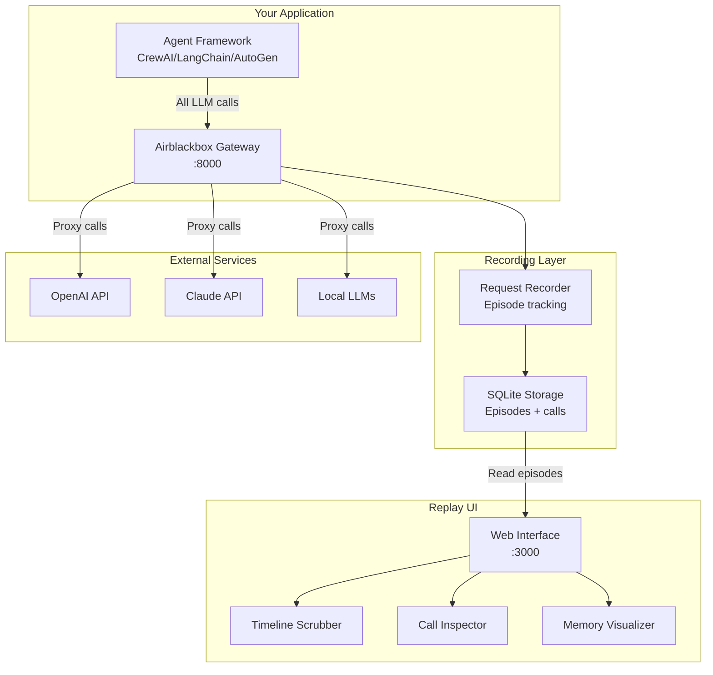

# Build a DVR for AI Agents: Episode Replay UI That Actually Works

Your AI agent just made 47 LLM calls, spawned 3 sub-agents, and somehow concluded that penguins are a type of fish — and you have no idea which step broke reality.

## The Problem: Agent Debugging is Detective Work Without Evidence

Here's what happens when your autonomous agent goes sideways:

```bash
Agent failed: Task completion unsuccessful
Tokens used: 15,847
Time elapsed: 4m 23s
```

That's it. That's your entire crime scene.

No call sequence. No decision tree. No "wait, why did it think the customer's billing address was in Antarctica?" Just a smoking crater where your confidence used to be.

Current debugging approaches fall into three categories of inadequate:

**Printf Debugging**: Sprinkle `console.log()` statements like breadcrumbs, hope they survive the multi-threaded chaos of agent execution, then piece together a timeline from scattered log files. Works great if your agent only makes one call and never branches.

**Trust-Based Development**: Ship it and see what breaks in production. Popular with people who enjoy 3 AM Slack notifications and explaining to customers why the AI agent just tried to order 10,000 rubber ducks.

**Vibes-Only Monitoring**: Watch token counts go up, response times fluctuate, and costs accumulate while having zero visibility into what your agent actually did. It's like monitoring a car by staring at the odometer.

What you actually need is a DVR for agent episodes. Rewind to any step, scrub through the timeline, see exactly which call returned the hallucination that sent everything off the rails.

## Architecture: The Agent DVR System



The system has three layers:

1. **Recording Layer**: Airblackbox Gateway sits between your agent and LLM providers, capturing every request/response pair with millisecond timestamps and correlation IDs
2. **Storage Layer**: Episodes (complete agent runs) contain sequences of calls with their context, tokens, and outcomes
3. **Replay Layer**: Web UI that lets you scrub through agent episodes like Netflix, but for debugging

## Implementation: Building the Agent DVR

### Step 1: Install and Configure Airblackbox

First, get the recording infrastructure:

```bash
pip install airblackbox
docker run -d \
  --name airblackbox-gateway \
  -p 8000:8000 \
  -v $(pwd)/data:/app/data \
  airblackbox/gateway:latest
```

### Step 2: Point Your Agent at the Gateway

Instead of calling OpenAI directly, route through the gateway:

```python
# Before: Direct OpenAI calls
from openai import OpenAI
client = OpenAI(api_key="sk-...")

# After: Through Airblackbox Gateway
client = OpenAI(
    api_key="sk-...",  # Your real API key
    base_url="http://localhost:8000/v1"  # Gateway endpoint
)
```

The gateway is OpenAI-compatible, so existing agent frameworks work without modification:

```python
from crewai import Agent, Task, Crew

# Your agents now automatically record everything
researcher = Agent(
    role='Research Analyst',
    goal='Find accurate information about {topic}',
    backstory='Expert researcher with attention to detail',
    llm=client  # Uses the gateway
)

task = Task(
    description='Research the latest developments in {topic}',
    agent=researcher
)

crew = Crew(agents=[researcher], tasks=[task])

# This entire execution gets recorded as one episode
result = crew.kickoff(inputs={'topic': 'quantum computing'})
```

### Step 3: Build the Episode Database Schema

Episodes need structure. Here's the SQLite schema that captures everything:

```python
import sqlite3
from datetime import datetime
from typing import List, Dict, Optional

class EpisodeRecorder:
    def __init__(self, db_path: str = "agent_episodes.db"):
        self.db_path = db_path
        self.init_db()
    
    def init_db(self):
        conn = sqlite3.connect(self.db_path)
        conn.executescript("""
            CREATE TABLE IF NOT EXISTS episodes (
                id TEXT PRIMARY KEY,
                name TEXT,
                status TEXT,  -- running, completed, failed
                start_time TIMESTAMP,
                end_time TIMESTAMP,
                total_tokens INTEGER DEFAULT 0,
                total_cost REAL DEFAULT 0.0,
                metadata JSON
            );
            
            CREATE TABLE IF NOT EXISTS calls (
                id TEXT PRIMARY KEY,
                episode_id TEXT,
                timestamp TIMESTAMP,
                model TEXT,
                prompt_tokens INTEGER,
                completion_tokens INTEGER,
                request_body JSON,
                response_body JSON,
                duration_ms INTEGER,
                cost REAL,
                FOREIGN KEY (episode_id) REFERENCES episodes (id)
            );
            
            CREATE INDEX IF NOT EXISTS idx_calls_episode 
            ON calls (episode_id, timestamp);
        """)
        conn.close()
    
    def start_episode(self, name: str, metadata: Dict = None) -> str:
        episode_id = f"ep_{datetime.now().strftime('%Y%m%d_%H%M%S')}"
        conn = sqlite3.connect(self.db_path)
        conn.execute(
            "INSERT INTO episodes (id, name, status, start_time, metadata) VALUES (?, ?, ?, ?, ?)",
            (episode_id, name, "running", datetime.now(), json.dumps(metadata or {}))
        )
        conn.commit()
        conn.close()
        return episode_id
    
    def end_episode(self, episode_id: str, status: str = "completed"):
        conn = sqlite3.connect(self.db_path)
        
        # Calculate totals from calls
        cursor = conn.execute(
            "SELECT SUM(prompt_tokens + completion_tokens), SUM(cost) FROM calls WHERE episode_id = ?",
            (episode_id,)
        )
        total_tokens, total_cost = cursor.fetchone()
        
        conn.execute(
            "UPDATE episodes SET status = ?, end_time = ?, total_tokens = ?, total_cost = ? WHERE id = ?",
            (status, datetime.now(), total_tokens or 0, total_cost or 0.0, episode_id)
        )
        conn.commit()
        conn.close()
```

### Step 4: Build the Timeline Scrubber UI

The DVR interface needs three components: episode list, timeline scrubber, and call inspector.

```python
import streamlit as st
import pandas as pd
import plotly.express as px
from datetime import datetime

class AgentDVR:
    def __init__(self, db_path: str):
        self.db_path = db_path
    
    def get_episodes(self) -> pd.DataFrame:
        conn = sqlite3.connect(self.db_path)
        df = pd.read_sql_query("""
            SELECT id, name, status, start_time, end_time, 
                   total_tokens, total_cost,
                   CASE 
                       WHEN end_time IS NOT NULL 
                       THEN (julianday(end_time) - julianday(start_time)) * 86400 
                       ELSE NULL 
                   END as duration_seconds
            FROM episodes 
            ORDER BY start_time DESC
        """, conn)
        conn.close()
        return df
    
    def get_episode_calls(self, episode_id: str) -> pd.DataFrame:
        conn = sqlite3.connect(self.db_path)
        df = pd.read_sql_query("""
            SELECT timestamp, model, prompt_tokens, completion_tokens,
                   request_body, response_body, duration_ms, cost
            FROM calls 
            WHERE episode_id = ?
            ORDER BY timestamp
        """, conn, params=(episode_id,))
        conn.close()
        
        # Parse JSON columns
        df['request'] = df['request_body'].apply(json.loads)
        df['response'] = df['response_body'].apply(json.loads)
        return df
    
    def render_timeline_scrubber(self, episode_id: str):
        calls_df = self.get_episode_calls(episode_id)
        
        if calls_df.empty:
            st.warning("No calls found for this episode")
            return None
        
        # Timeline visualization
        fig = px.scatter(calls_df, 
                        x='timestamp', 
                        y='model',
                        size='completion_tokens',
                        color='duration_ms',
                        hover_data=['prompt_tokens', 'cost'])
        
        fig.update_layout(
            title="Agent Call Timeline",
            xaxis_title="Time",
            yaxis_title="Model",
            height=300
        )
        
        st.plotly_chart(fig, use_container_width=True)
        
        # Timeline scrubber
        if len(calls_df) > 1:
            selected_index = st.slider(
                "Scrub through timeline",
                0, len(calls_df) - 1,
                value=len(calls_df) - 1,
                format="Call %d"
            )
            return selected_index
        return 0
    
    def render_call_inspector(self, calls_df: pd.DataFrame, call_index: int):
        if calls_df.empty or call_index >= len(calls_df):
            return
            
        call = calls_df.iloc[call_index]
        
        col1, col2, col3 = st.columns(3)
        with col1:
            st.metric("Tokens", f"{call['prompt_tokens'] + call['completion_tokens']}")
        with col2:
            st.metric("Duration", f"{call['duration_ms']}ms")
        with col3:
            st.metric("Cost", f"${call['cost']:.4f}")
        
        # Request inspection
        st.subheader("Request")
        request = call['request']
        if 'messages' in request:
            for i, msg in enumerate(request['messages']):
                with st.expander(f"Message {i+1}: {msg.get('role', 'unknown')}"):
                    st.code(msg.get('content', ''), language='text')
        
        # Response inspection
        st.subheader("Response")
        response = call['response']
        if 'choices' in response:
            for i, choice in enumerate(response['choices']):
                with st.expander(f"Choice {i+1}"):
                    content = choice.get('message', {}).get('content', '')
                    st.code(content, language='text')

# Main Streamlit app
def main():
    st.set_page_config(page_title="Agent DVR", layout="wide")
    st.title("🎬 Agent DVR: Replay Your AI Episodes")
    
    dvr = AgentDVR("agent_episodes.db")
    
    # Episode selector
    episodes_df = dvr.get_episodes()
    
    if episodes_df.empty:
        st.warning("No episodes recorded yet. Run an agent with Airblackbox Gateway to see episodes here.")
        return
    
    # Episode list in sidebar
    with st.sidebar:
        st.subheader("Episodes")
        for _, episode in episodes_df.iterrows():
            status_emoji = {"completed": "✅", "failed": "❌", "running": "🔄"}.get(episode['status'], "❓")
            if st.button(f"{status_emoji} {episode['name']}", key=episode['id']):
                st.session_state.selected_episode = episode['id']
    
    # Main content
    if 'selected_episode' in st.session_state:
        episode_id = st.session_state.selected_episode
        
        # Episode header
        episode_info = episodes_df[episodes_df['id'] == episode_id].iloc[0]
        st.subheader(f"Episode: {episode_info['name']}")
        
        col1, col2, col3, col4 = st.columns(4)
        with col1:
            st.metric("Status", episode_info['status'])
        with col2:
            st.metric("Duration", f"{episode_info['duration_seconds']:.1f}s" if episode_info['duration_seconds'] else "Running...")
        with col3:
            st.metric("Total Tokens", episode_info['total_tokens'])
        with col4:
            st.metric("Total Cost", f"${episode_info['total_cost']:.4f}")
        
        # Timeline and inspector
        selected_call = dvr.render_timeline_scrubber(episode_id)
        
        if selected_call is not None:
            calls_df = dvr.get_episode_calls(episode_id)
            dvr.render_call_inspector(calls_df, selected_call)

if __name__ == "__main__":
    main()
```

### Step 5: Integrate with Your Agent Framework

Wrap your agent execution to automatically create episodes:

```python
import json
from contextlib import contextmanager

@contextmanager
def episode_recording(name: str, metadata: Dict = None):
    recorder = EpisodeRecorder()
    episode_id = recorder.start_episode(name, metadata)
    
    # Set episode ID in request headers so gateway can correlate calls
    import os
    os.environ['AIRBLACKBOX_EPISODE_ID'] = episode_id
    
    try:
        yield episode_id
        recorder.end_episode(episode_id, "completed")
    except Exception as e:
        recorder.end_episode(episode_id, "failed")
        raise

# Usage with any agent framework
with episode_recording("Customer Support Analysis", {"customer_id": "cust_123"}):
    result = crew.kickoff(inputs={'customer_query': 'Why is my bill so high?'})
```

## Pitfalls: What Will Break and How to Handle It

### Memory Explosion with Large Episodes

Long-running agents can generate thousands of calls. The UI will choke trying to render them all.

**Solution**: Implement pagination and call filtering:

```python
def get_episode_calls(self, episode_id: str, limit: int = 100, offset: int = 0) -> pd.DataFrame:
    conn = sqlite3.connect(self.db_path)
    df = pd.read_sql_query("""
        SELECT timestamp, model, prompt_tokens, completion_tokens,
               request_body, response_body, duration_ms, cost
        FROM calls 
        WHERE episode_id = ?
        ORDER BY timestamp
        LIMIT ? OFFSET ?
    """, conn, params=(episode_id, limit, offset))
    conn.close()
    return df
```

### Gateway Connection Failures

If the gateway goes down, your agents break completely.

**Solution**: Implement fallback with circuit breaker pattern:

```python
import time
from typing import Optional

class ResilientClient:
    def __init__(self, primary_url: str, fallback_url: str, api_key: str):
        self.primary = OpenAI(api_key=api_key, base_url=primary_url)
        self.fallback = OpenAI(api_key=api_key, base_url=fallback_url)
        self.failure_count = 0
        self.last_failure_time = 0
        self.circuit_open_duration = 60  # seconds
    
    def chat_completions_create(self, **kwargs):
        # Circuit breaker logic
        if self.failure_count >= 3:
            if time.time() - self.last_failure_time < self.circuit_open_duration:
                return self.fallback.chat.completions.create(**kwargs)
            else:
                self.failure_count = 0  # Reset circuit breaker
        
        try:
            response = self.primary.chat.completions.create(**kwargs)
            self.failure_count = 0
            return response
        except Exception as e:
            self.failure_count += 1
            self.last_failure_time = time.time()
            print(f"Gateway failed, falling back to direct API: {e}")
            return self.fallback.chat.completions.create(**kwargs)
```

### JSON Serialization Errors

Complex request/response objects can break JSON serialization.

**Solution**: Custom JSON encoder that handles edge cases:

```python
import json
import numpy as np
from datetime import datetime

class SafeJSONEncoder(json.JSONEncoder):
    def default(self, obj):
        if isinstance(obj, np.ndarray):
            return obj.tolist()
        if isinstance(obj, datetime):
            return obj.isoformat()
        if hasattr(obj, '__dict__'):
            return obj.__dict__
        return str(obj)

# Use in your recorder
json.dumps(request_data, cls=SafeJSONEncoder)
```

## Measurement: How to Know It's Working

Your DVR is working when:

1. **Episode Completeness**: Every agent run shows up as an episode with start/end times
2. **Call Correlation**: All LLM calls within an episode are properly linked and timestamped
3. **Timeline Accuracy**: You can scrub through calls and see the exact sequence of agent decisions
4. **Performance Impact**: Less than 50ms latency added to LLM calls (measure with `time.time()` before/after)

Test with this validation script:

```python
def validate_episode_recording():
    # Run a simple agent task
    with episode_recording("Validation Test"):
        client = OpenAI(base_url="http://localhost:8000/v1", api_key=os.getenv("OPENAI_API_KEY"))
        
        start_time = time.time()
        response = client.chat.completions.create(
            model="gpt-3.5-turbo",
            messages=[{"role": "user", "content": "What is 2+2?"}]
        )
        latency = (time.time() - start_time) * 1000
    
    # Verify recording
    dvr = AgentDVR("agent_episodes.db")
    episodes = dvr.get_episodes()
    
    assert not episodes.empty, "No episodes recorded"
    assert episodes.iloc[0]['status'] == 'completed', "Episode not marked complete"
    assert latency < 50, f"Too much latency: {latency}ms"
    
    episode_calls = dvr.get_episode_calls(episodes.iloc[0]['id'])
    assert not episode_calls.empty, "No calls recorded for episode"
    
    print("✅ Episode recording validation passed")
```

## Next Steps

Your agent DVR is running. Now you can:

- Rewind any agent episode to see exactly where it went wrong
- Compare successful vs failed episodes to identify patterns
- Share timestamped links to specific agent decisions with your team
- Build automated alerts when agents make unexpected call sequences

Try the complete implementation: **[Clone the Agent DVR repo](https://github.com/airblackboxio/agent-dvr-tutorial)** with working code, database setup, and Streamlit UI.

Or get the enterprise version: **[Airblackbox](https://airblackbox.io)** handles the infrastructure, adds EU AI Act compliance scanning, and scales to thousands of episodes.

Because debugging agents by vibes is like flying blind. And nobody has time for that.