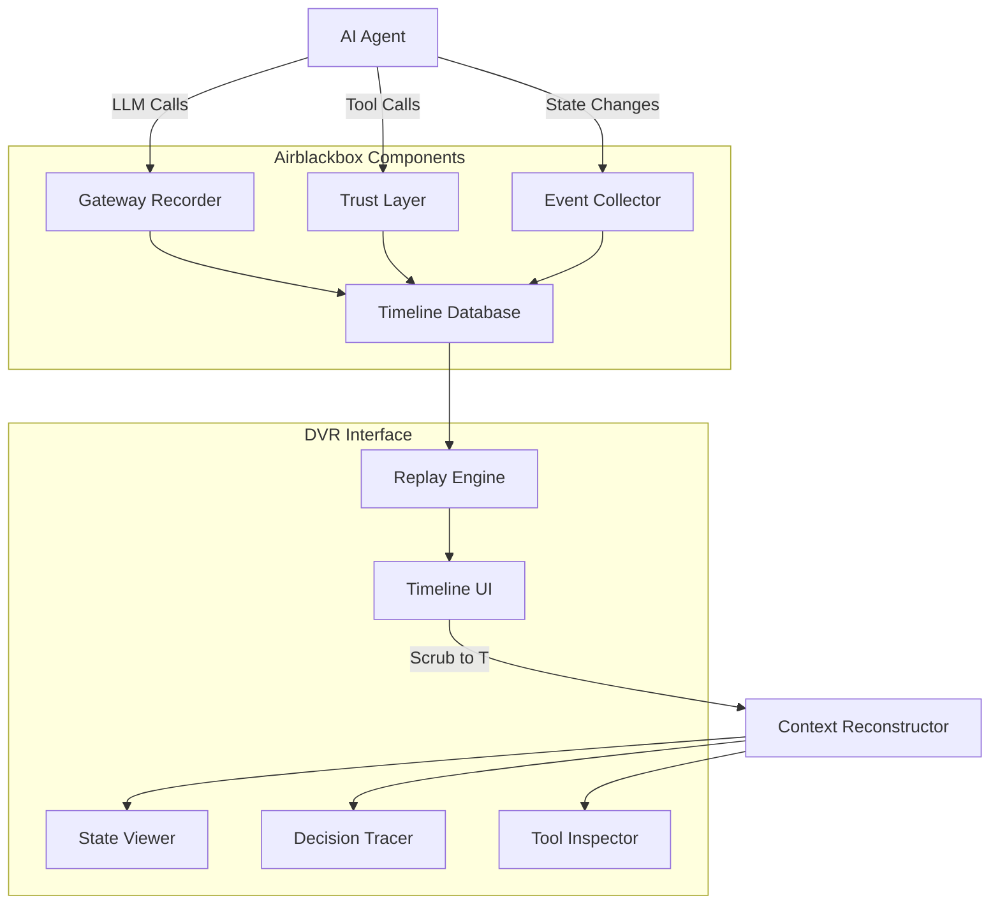

# Build a DVR for AI Agents: Episode Replay UI That Actually Works

Your AI agent just ran for 3 hours, made 847 LLM calls, processed 23 documents, and somehow decided that "banana" is the optimal solution to your customer's pricing inquiry — and you have zero idea why.

## The Problem: Agent Debugging is Time Travel Without a Map

Here's what debugging autonomous agents looks like today: you stare at logs that read like a fever dream, try to reconstruct the agent's decision tree from scattered print statements, and eventually resort to the debugging strategy of "add more logs and pray."

The problem isn't just that agents are black boxes — it's that they're *temporal* black boxes. Unlike traditional software where you can set breakpoints and step through code, agents make decisions over time. They reason, remember, forget, and pivot based on context you can't see.

Current solutions fall into two equally useless camps:

1. **Log dumps**: 50,000 lines of JSON that tell you everything except what you actually need to know
2. **Static dashboards**: Pretty charts that show you what happened but not *why* it happened

What you actually need is a DVR. Something that lets you scrub through your agent's execution timeline, see the exact context at each decision point, and understand the chain of reasoning that led to catastrophe.

That's not a metaphor. That's literally what we're building.

## Architecture: The Agent DVR System

Here's how we'll build a timeline scrubber that actually works:



The key insight: we need to capture three types of events in perfect temporal order:

1. **LLM interactions**: Every prompt, response, and token
2. **Tool executions**: Function calls, file operations, API requests
3. **State mutations**: Memory updates, context shifts, decision points

Then we need a UI that lets you scrub through time and reconstruct the agent's exact mental state at any moment.

## Implementation: Building the Agent DVR

### Step 1: Event Collection Infrastructure

First, let's build the event collector that captures everything:

```python
import asyncio
import json
import time
from datetime import datetime, timezone
from dataclasses import dataclass, asdict
from typing import Dict, List, Any, Optional
import sqlite3
from contextlib import asynccontextmanager

@dataclass
class AgentEvent:
    timestamp: float
    event_id: str
    event_type: str  # 'llm_call', 'tool_call', 'state_change'
    session_id: str
    data: Dict[str, Any]
    context: Dict[str, Any]

class TimelineRecorder:
    def __init__(self, db_path: str = "agent_timeline.db"):
        self.db_path = db_path
        self._init_db()
    
    def _init_db(self):
        conn = sqlite3.connect(self.db_path)
        conn.execute("""
            CREATE TABLE IF NOT EXISTS events (
                id INTEGER PRIMARY KEY AUTOINCREMENT,
                timestamp REAL NOT NULL,
                event_id TEXT UNIQUE NOT NULL,
                event_type TEXT NOT NULL,
                session_id TEXT NOT NULL,
                data TEXT NOT NULL,
                context TEXT NOT NULL
            )
        """)
        conn.execute("CREATE INDEX IF NOT EXISTS idx_session_time ON events(session_id, timestamp)")
        conn.commit()
        conn.close()
    
    async def record_event(self, event: AgentEvent):
        conn = sqlite3.connect(self.db_path)
        try:
            conn.execute("""
                INSERT INTO events (timestamp, event_id, event_type, session_id, data, context)
                VALUES (?, ?, ?, ?, ?, ?)
            """, (
                event.timestamp,
                event.event_id,
                event.event_type,
                event.session_id,
                json.dumps(event.data),
                json.dumps(event.context)
            ))
            conn.commit()
        finally:
            conn.close()
    
    def get_timeline(self, session_id: str, start_time: Optional[float] = None, 
                     end_time: Optional[float] = None) -> List[AgentEvent]:
        conn = sqlite3.connect(self.db_path)
        
        query = "SELECT * FROM events WHERE session_id = ?"
        params = [session_id]
        
        if start_time:
            query += " AND timestamp >= ?"
            params.append(start_time)
        
        if end_time:
            query += " AND timestamp <= ?"
            params.append(end_time)
        
        query += " ORDER BY timestamp ASC"
        
        cursor = conn.execute(query, params)
        events = []
        
        for row in cursor.fetchall():
            events.append(AgentEvent(
                timestamp=row[1],
                event_id=row[2],
                event_type=row[3],
                session_id=row[4],
                data=json.loads(row[5]),
                context=json.loads(row[6])
            ))
        
        conn.close()
        return events

# Global recorder instance
recorder = TimelineRecorder()
```

### Step 2: Agent Instrumentation

Now let's instrument an AI agent to capture all events:

```python
import uuid
from typing import Callable, Any
import openai

class DVRAgent:
    def __init__(self, session_id: str = None):
        self.session_id = session_id or str(uuid.uuid4())
        self.context = {"memory": {}, "step": 0}
        self.client = openai.AsyncOpenAI()
    
    async def _record_llm_call(self, prompt: str, response: str, model: str):
        event = AgentEvent(
            timestamp=time.time(),
            event_id=str(uuid.uuid4()),
            event_type="llm_call",
            session_id=self.session_id,
            data={
                "prompt": prompt,
                "response": response,
                "model": model,
                "token_count": len(response.split())  # Simplified
            },
            context=self.context.copy()
        )
        await recorder.record_event(event)
    
    async def _record_tool_call(self, tool_name: str, args: Dict, result: Any):
        event = AgentEvent(
            timestamp=time.time(),
            event_id=str(uuid.uuid4()),
            event_type="tool_call",
            session_id=self.session_id,
            data={
                "tool_name": tool_name,
                "arguments": args,
                "result": str(result),
                "success": True
            },
            context=self.context.copy()
        )
        await recorder.record_event(event)
    
    async def _record_state_change(self, change_type: str, old_state: Any, new_state: Any):
        event = AgentEvent(
            timestamp=time.time(),
            event_id=str(uuid.uuid4()),
            event_type="state_change",
            session_id=self.session_id,
            data={
                "change_type": change_type,
                "old_state": old_state,
                "new_state": new_state
            },
            context=self.context.copy()
        )
        await recorder.record_event(event)
    
    async def think(self, prompt: str) -> str:
        """Make an LLM call with full recording"""
        self.context["step"] += 1
        
        response = await self.client.chat.completions.create(
            model="gpt-4",
            messages=[{"role": "user", "content": prompt}]
        )
        
        response_text = response.choices[0].message.content
        await self._record_llm_call(prompt, response_text, "gpt-4")
        
        return response_text
    
    async def use_tool(self, tool_name: str, **kwargs) -> Any:
        """Execute a tool with recording"""
        # Simulate tool execution
        if tool_name == "search_web":
            result = f"Found {len(kwargs.get('query', ''))} results for: {kwargs.get('query')}"
        elif tool_name == "read_file":
            result = f"File {kwargs.get('path')} contains important data"
        else:
            result = f"Tool {tool_name} executed with {kwargs}"
        
        await self._record_tool_call(tool_name, kwargs, result)
        return result
    
    async def update_memory(self, key: str, value: Any):
        """Update agent memory with recording"""
        old_value = self.context["memory"].get(key)
        self.context["memory"][key] = value
        
        await self._record_state_change("memory_update", old_value, value)
```

### Step 3: Timeline Replay Engine

The magic happens in the replay engine — this reconstructs agent state at any point in time:

```python
class TimelineReplay:
    def __init__(self, recorder: TimelineRecorder):
        self.recorder = recorder
    
    def get_state_at_time(self, session_id: str, target_time: float) -> Dict[str, Any]:
        """Reconstruct agent state at a specific timestamp"""
        events = self.recorder.get_timeline(session_id, end_time=target_time)
        
        # Rebuild state by replaying events chronologically
        state = {
            "memory": {},
            "context": {},
            "llm_history": [],
            "tool_history": [],
            "step": 0
        }
        
        for event in events:
            if event.event_type == "state_change":
                if event.data["change_type"] == "memory_update":
                    # Apply memory changes
                    state["memory"].update(event.context.get("memory", {}))
            
            elif event.event_type == "llm_call":
                state["llm_history"].append({
                    "timestamp": event.timestamp,
                    "prompt": event.data["prompt"],
                    "response": event.data["response"],
                    "context": event.context
                })
                state["step"] = event.context.get("step", 0)
            
            elif event.event_type == "tool_call":
                state["tool_history"].append({
                    "timestamp": event.timestamp,
                    "tool": event.data["tool_name"],
                    "args": event.data["arguments"],
                    "result": event.data["result"]
                })
        
        return state
    
    def get_timeline_summary(self, session_id: str) -> Dict[str, Any]:
        """Get a summary of the entire timeline"""
        events = self.recorder.get_timeline(session_id)
        if not events:
            return {"error": "No events found"}
        
        return {
            "session_id": session_id,
            "duration": events[-1].timestamp - events[0].timestamp,
            "total_events": len(events),
            "llm_calls": len([e for e in events if e.event_type == "llm_call"]),
            "tool_calls": len([e for e in events if e.event_type == "tool_call"]),
            "state_changes": len([e for e in events if e.event_type == "state_change"]),
            "start_time": events[0].timestamp,
            "end_time": events[-1].timestamp
        }

replay_engine = TimelineReplay(recorder)
```

### Step 4: The DVR UI (Simplified Web Interface)

Here's a Flask-based UI that gives you timeline scrubbing:

```python
from flask import Flask, render_template, jsonify, request
import json

app = Flask(__name__)

@app.route('/')
def dvr_interface():
    return render_template('dvr.html')

@app.route('/api/sessions')
def get_sessions():
    # Get all unique session IDs
    conn = sqlite3.connect(recorder.db_path)
    cursor = conn.execute("SELECT DISTINCT session_id FROM events ORDER BY timestamp DESC")
    sessions = [row[0] for row in cursor.fetchall()]
    conn.close()
    
    return jsonify(sessions)

@app.route('/api/timeline/<session_id>')
def get_timeline_data(session_id):
    summary = replay_engine.get_timeline_summary(session_id)
    events = recorder.get_timeline(session_id)
    
    timeline_data = []
    for event in events:
        timeline_data.append({
            "timestamp": event.timestamp,
            "type": event.event_type,
            "data": event.data,
            "context": event.context
        })
    
    return jsonify({
        "summary": summary,
        "events": timeline_data
    })

@app.route('/api/state/<session_id>')
def get_state_at_time(session_id):
    target_time = float(request.args.get('time', time.time()))
    state = replay_engine.get_state_at_time(session_id, target_time)
    return jsonify(state)

if __name__ == '__main__':
    app.run(debug=True)
```

### Step 5: Testing the DVR

Let's create a test scenario that shows the DVR in action:

```python
async def simulate_agent_workflow():
    """Simulate a complex agent workflow for testing"""
    agent = DVRAgent()
    print(f"Starting agent session: {agent.session_id}")
    
    # Multi-step reasoning workflow
    await agent.update_memory("user_goal", "find pricing for enterprise software")
    
    thought1 = await agent.think("What information do I need to help with enterprise software pricing?")
    
    search_results = await agent.use_tool("search_web", query="enterprise software pricing models")
    
    await agent.update_memory("search_results", search_results)
    
    thought2 = await agent.think(f"Based on these search results: {search_results}, what are the key pricing factors?")
    
    pricing_data = await agent.use_tool("read_file", path="pricing_database.json")
    
    final_thought = await agent.think(f"Given the search results and pricing data, provide a comprehensive answer about enterprise software pricing")
    
    await agent.update_memory("final_recommendation", final_thought)
    
    print(f"Agent workflow complete. Session ID: {agent.session_id}")
    return agent.session_id

# Run the simulation
session_id = asyncio.run(simulate_agent_workflow())

# Now inspect the timeline
summary = replay_engine.get_timeline_summary(session_id)
print(f"\nTimeline Summary: {json.dumps(summary, indent=2)}")

# Get state at midpoint
events = recorder.get_timeline(session_id)
midpoint_time = (events[0].timestamp + events[-1].timestamp) / 2
midpoint_state = replay_engine.get_state_at_time(session_id, midpoint_time)
print(f"\nState at midpoint: {json.dumps(midpoint_state, indent=2)}")
```

## Pitfalls: What Will Break and How to Handle It

### 1. Timeline Consistency
**Problem**: Events recorded out of order due to async execution.
**Solution**: Use high-precision timestamps and sequence numbers for ordering.

```python
import time
from threading import Lock

class SequencedRecorder(TimelineRecorder):
    def __init__(self, *args, **kwargs):
        super().__init__(*args, **kwargs)
        self._sequence = 0
        self._lock = Lock()
    
    def _next_sequence(self):
        with self._lock:
            self._sequence += 1
            return self._sequence
    
    async def record_event(self, event: AgentEvent):
        event.data["sequence"] = self._next_sequence()
        await super().record_event(event)
```

### 2. Memory Explosion
**Problem**: Large contexts and responses blow up your database.
**Solution**: Implement smart truncation and compression.

```python
import gzip
import base64

def compress_large_data(data: str, max_size: int = 10000) -> str:
    if len(data) <= max_size:
        return data
    
    # Compress and encode
    compressed = gzip.compress(data.encode('utf-8'))
    encoded = base64.b64encode(compressed).decode('ascii')
    
    return f"[COMPRESSED:{len(data)}]{encoded}"

def decompress_data(data: str) -> str:
    if not data.startswith("[COMPRESSED:"):
        return data
    
    # Extract compressed data
    marker_end = data.find("]")
    compressed_data = data[marker_end + 1:]
    
    # Decode and decompress
    decoded = base64.b64decode(compressed_data.encode('ascii'))
    return gzip.decompress(decoded).decode('utf-8')
```

### 3. Performance at Scale
**Problem**: Querying timelines becomes slow with millions of events.
**Solution**: Implement time-based sharding and efficient indexing.

```python
class ShardedTimelineRecorder(TimelineRecorder):
    def __init__(self, base_path: str = "timeline"):
        self.base_path = base_path
        self._shard_cache = {}
    
    def _get_shard_path(self, timestamp: float) -> str:
        # Shard by day
        day = int(timestamp // 86400)  # seconds per day
        return f"{self.base_path}_shard_{day}.db"
    
    async def record_event(self, event: AgentEvent):
        shard_path = self._get_shard_path(event.timestamp)
        
        if shard_path not in self._shard_cache:
            self._shard_cache[shard_path] = TimelineRecorder(shard_path)
        
        await self._shard_cache[shard_path].record_event(event)
```

## Measurement: How to Know It's Working

Your DVR is working when you can answer these questions in under 30 seconds:

1. **"Why did my agent choose option B instead of option A at 14:32:17?"**
2. **"What was the exact context when the agent made its third API call?"**
3. **"How did the agent's memory change between steps 5 and 6?"**

Test with this validation script:

```python
def validate_dvr_functionality():
    # Test 1: Event ordering
    events = recorder.get_timeline(session_id)
    assert all(events[i].timestamp <= events[i+1].timestamp for i in range(len(events)-1))
    
    # Test 2: State reconstruction
    for i, event in enumerate(events[::10]):  # Sample every 10th event
        state = replay_engine.get_state_at_time(session_id, event.timestamp)
        assert "memory" in state
        assert "llm_history" in state
    
    # Test 3: Query performance
    start_time = time.time()
    large_timeline = recorder.get_timeline(session_id)
    query_time = time.time() - start_time
    assert query_time < 1.0  # Should be under 1 second
    
    print("✅ DVR validation passed!")

validate_dvr_functionality()
```

## Next Steps: From Prototype to Production

This DVR gives you the foundation for real agent observability. But this is just the beginning.

The complete Airblackbox implementation handles the hard parts we glossed over:

- **Distributed tracing** across multiple agent instances
- **Smart context compression** that preserves debuggability
- **Real-time streaming** for live debugging
- **Security boundaries** for sensitive data
- **Performance optimization** for production workloads

Want to see the full system in action? Clone the [Airblackbox Agent DVR demo](https://github.com/airblackbox/agent-dvr-demo) and watch your first agent timeline in under 5 minutes.

Because debugging shouldn't feel like archaeology. It should feel like time travel with a really good map.

---

*Mr. Bigglesworth ships code that developers actually use. Unlike most developer advocates, who ship slide decks that executives actually ignore.*