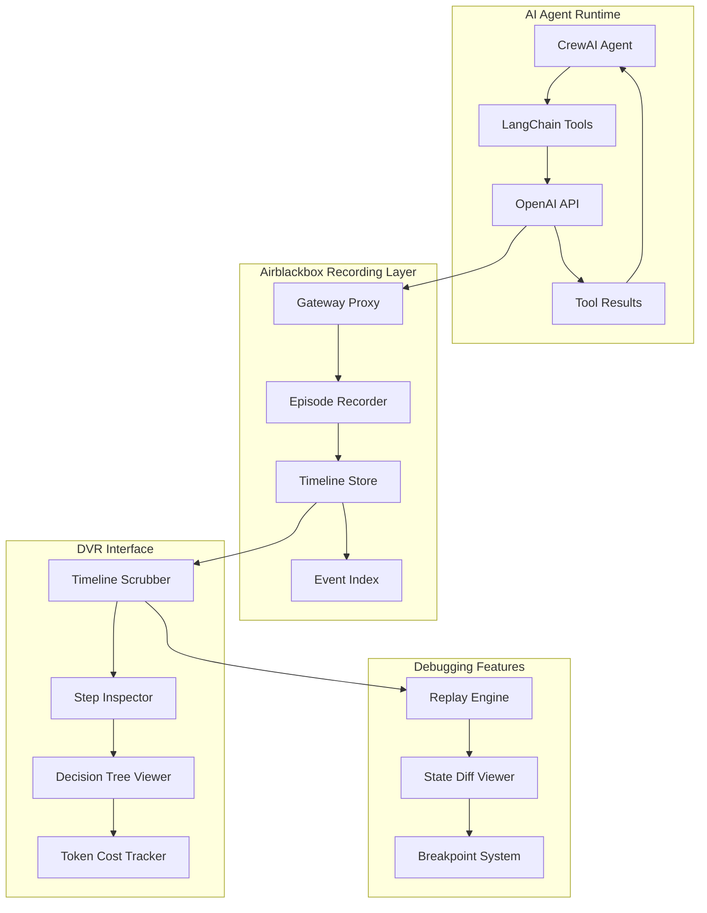

# Build a DVR for AI Agents: Episode Replay UI That Actually Works

Your AI agent made 47 LLM calls, spent $3.20 on tokens, and still couldn't book a restaurant reservation — but you have no idea which call broke the logic chain.

## The Problem: AI Agent Debugging is Still Cave Painting

Here's what happens when your CrewAI agents go sideways at 2 AM:

You get a stack trace that ends with `openai.BadRequestError` and a chat log that looks like this:
```
Agent: I need to book a table
LLM: I'll help you book a table
Agent: Great, book it for 2 people
LLM: I don't have access to restaurant booking
Agent: But you just said you'd help
LLM: I apologize for the confusion
Agent: *spends $2.80 in circles*
```

The current debugging experience is archaeological. You dig through logs, grep for error patterns, and try to reverse-engineer what your agent was "thinking" at step 23 of a 47-step conversation. It's like debugging a distributed system where every node has amnesia.

What you need is a DVR for AI agents. Something that records every decision, lets you scrub through the timeline, and replay exactly what happened at each step. Not just the final output — the entire cognitive workflow.

## Architecture: Agent DVR with Timeline Scrubbing

Here's how we build a proper episode replay system:



The key insight: treat each agent conversation as a recorded "episode" with frame-by-frame navigation. Every LLM call becomes a timeline event with full context — prompt, response, reasoning, tool calls, and state changes.

## Implementation: Building the Agent DVR

### Step 1: Episode Recording Infrastructure

First, we need to capture every agent decision with full context:

```python
from datetime import datetime, timezone
from dataclasses import dataclass, asdict
from typing import List, Dict, Any, Optional
import json
import sqlite3
from pathlib import Path

@dataclass
class AgentEvent:
    timestamp: str
    event_type: str  # 'llm_call', 'tool_call', 'decision', 'error'
    agent_name: str
    step_number: int
    content: Dict[str, Any]
    tokens_used: int
    cost_cents: int
    duration_ms: int
    parent_event_id: Optional[str] = None
    event_id: Optional[str] = None

class EpisodeRecorder:
    def __init__(self, db_path: str = "./agent_episodes.db"):
        self.db_path = Path(db_path)
        self.db_path.parent.mkdir(parents=True, exist_ok=True)
        self._init_db()
        
    def _init_db(self):
        conn = sqlite3.connect(self.db_path)
        conn.execute("""
            CREATE TABLE IF NOT EXISTS episodes (
                episode_id TEXT PRIMARY KEY,
                agent_name TEXT,
                start_time TEXT,
                end_time TEXT,
                total_tokens INTEGER DEFAULT 0,
                total_cost_cents INTEGER DEFAULT 0,
                status TEXT DEFAULT 'running'
            )
        """)
        
        conn.execute("""
            CREATE TABLE IF NOT EXISTS events (
                event_id TEXT PRIMARY KEY,
                episode_id TEXT,
                timestamp TEXT,
                event_type TEXT,
                agent_name TEXT,
                step_number INTEGER,
                content TEXT,
                tokens_used INTEGER,
                cost_cents INTEGER,
                duration_ms INTEGER,
                parent_event_id TEXT,
                FOREIGN KEY (episode_id) REFERENCES episodes (episode_id)
            )
        """)
        
        conn.execute("CREATE INDEX IF NOT EXISTS idx_episode_events ON events(episode_id, step_number)")
        conn.commit()
        conn.close()
    
    def start_episode(self, agent_name: str) -> str:
        episode_id = f"{agent_name}_{datetime.now(timezone.utc).isoformat()}"
        conn = sqlite3.connect(self.db_path)
        conn.execute(
            "INSERT INTO episodes (episode_id, agent_name, start_time) VALUES (?, ?, ?)",
            (episode_id, agent_name, datetime.now(timezone.utc).isoformat())
        )
        conn.commit()
        conn.close()
        return episode_id
    
    def record_event(self, episode_id: str, event: AgentEvent) -> str:
        event_id = f"{episode_id}_{event.step_number}_{event.event_type}"
        event.event_id = event_id
        
        conn = sqlite3.connect(self.db_path)
        conn.execute("""
            INSERT INTO events 
            (event_id, episode_id, timestamp, event_type, agent_name, step_number, 
             content, tokens_used, cost_cents, duration_ms, parent_event_id)
            VALUES (?, ?, ?, ?, ?, ?, ?, ?, ?, ?, ?)
        """, (
            event_id, episode_id, event.timestamp, event.event_type,
            event.agent_name, event.step_number, json.dumps(event.content),
            event.tokens_used, event.cost_cents, event.duration_ms,
            event.parent_event_id
        ))
        conn.commit()
        conn.close()
        return event_id
```

### Step 2: LangChain Integration with Recording

Now we instrument a LangChain agent to record every decision:

```python
from langchain.agents import AgentExecutor, create_openai_functions_agent
from langchain_openai import ChatOpenAI
from langchain.prompts import ChatPromptTemplate
from langchain.tools import Tool
import time
from typing import Dict, Any

class RecordingAgent:
    def __init__(self, recorder: EpisodeRecorder, tools: List[Tool]):
        self.recorder = recorder
        self.episode_id = None
        self.step_counter = 0
        
        # Create LangChain agent
        self.llm = ChatOpenAI(temperature=0)
        prompt = ChatPromptTemplate.from_messages([
            ("system", "You are a helpful assistant that uses tools to complete tasks."),
            ("human", "{input}"),
            ("placeholder", "{agent_scratchpad}")
        ])
        
        agent = create_openai_functions_agent(self.llm, tools, prompt)
        self.executor = AgentExecutor(agent=agent, tools=tools, verbose=True)
        
        # Hook into the execution flow
        self._monkey_patch_executor()
    
    def _monkey_patch_executor(self):
        original_plan = self.executor.agent.plan
        original_llm_call = self.llm._generate
        
        def recording_plan(intermediate_steps, callbacks, **kwargs):
            start_time = time.time()
            self.step_counter += 1
            
            try:
                result = original_plan(intermediate_steps, callbacks, **kwargs)
                
                # Record the planning step
                self.recorder.record_event(self.episode_id, AgentEvent(
                    timestamp=datetime.now(timezone.utc).isoformat(),
                    event_type="agent_plan",
                    agent_name="langchain_agent",
                    step_number=self.step_counter,
                    content={
                        "input": kwargs.get("input", ""),
                        "intermediate_steps": [str(step) for step in intermediate_steps],
                        "plan": str(result)
                    },
                    tokens_used=0,  # Filled by LLM hook
                    cost_cents=0,   # Filled by LLM hook
                    duration_ms=int((time.time() - start_time) * 1000)
                ))
                
                return result
            except Exception as e:
                self.recorder.record_event(self.episode_id, AgentEvent(
                    timestamp=datetime.now(timezone.utc).isoformat(),
                    event_type="error",
                    agent_name="langchain_agent",
                    step_number=self.step_counter,
                    content={"error": str(e), "type": type(e).__name__},
                    tokens_used=0,
                    cost_cents=0,
                    duration_ms=int((time.time() - start_time) * 1000)
                ))
                raise
        
        self.executor.agent.plan = recording_plan
    
    def run_episode(self, task: str) -> str:
        self.episode_id = self.recorder.start_episode("langchain_agent")
        
        try:
            result = self.executor.invoke({"input": task})
            
            # Mark episode as completed
            conn = sqlite3.connect(self.recorder.db_path)
            conn.execute(
                "UPDATE episodes SET end_time = ?, status = ? WHERE episode_id = ?",
                (datetime.now(timezone.utc).isoformat(), "completed", self.episode_id)
            )
            conn.commit()
            conn.close()
            
            return result
            
        except Exception as e:
            # Mark episode as failed
            conn = sqlite3.connect(self.recorder.db_path)
            conn.execute(
                "UPDATE episodes SET end_time = ?, status = ? WHERE episode_id = ?",
                (datetime.now(timezone.utc).isoformat(), "failed", self.episode_id)
            )
            conn.commit()
            conn.close()
            raise
```

### Step 3: Timeline Scrubber Interface

Now for the DVR interface — a web UI that lets you scrub through agent decisions:

```python
from flask import Flask, render_template, jsonify, request
import sqlite3
import json
from typing import List, Dict

class AgentDVR:
    def __init__(self, db_path: str):
        self.db_path = db_path
        self.app = Flask(__name__)
        self._setup_routes()
    
    def _setup_routes(self):
        @self.app.route('/')
        def index():
            return render_template('dvr.html')
        
        @self.app.route('/api/episodes')
        def get_episodes():
            conn = sqlite3.connect(self.db_path)
            cursor = conn.execute("""
                SELECT episode_id, agent_name, start_time, end_time, 
                       total_tokens, total_cost_cents, status,
                       COUNT(events.event_id) as event_count
                FROM episodes 
                LEFT JOIN events ON episodes.episode_id = events.episode_id
                GROUP BY episode_id
                ORDER BY start_time DESC
                LIMIT 50
            """)
            
            episodes = []
            for row in cursor.fetchall():
                episodes.append({
                    'episode_id': row[0],
                    'agent_name': row[1],
                    'start_time': row[2],
                    'end_time': row[3],
                    'total_tokens': row[4],
                    'total_cost_cents': row[5],
                    'status': row[6],
                    'event_count': row[7]
                })
            
            conn.close()
            return jsonify(episodes)
        
        @self.app.route('/api/episodes/<episode_id>/timeline')
        def get_timeline(episode_id):
            conn = sqlite3.connect(self.db_path)
            cursor = conn.execute("""
                SELECT event_id, timestamp, event_type, step_number, content,
                       tokens_used, cost_cents, duration_ms
                FROM events 
                WHERE episode_id = ?
                ORDER BY step_number
            """, (episode_id,))
            
            timeline = []
            for row in cursor.fetchall():
                timeline.append({
                    'event_id': row[0],
                    'timestamp': row[1],
                    'event_type': row[2],
                    'step_number': row[3],
                    'content': json.loads(row[4]),
                    'tokens_used': row[5],
                    'cost_cents': row[6],
                    'duration_ms': row[7]
                })
            
            conn.close()
            return jsonify(timeline)
        
        @self.app.route('/api/episodes/<episode_id>/step/<int:step>')
        def get_step_detail(episode_id, step):
            conn = sqlite3.connect(self.db_path)
            cursor = conn.execute("""
                SELECT * FROM events 
                WHERE episode_id = ? AND step_number = ?
            """, (episode_id, step))
            
            row = cursor.fetchone()
            if not row:
                return jsonify({'error': 'Step not found'}), 404
            
            step_detail = {
                'event_id': row[0],
                'timestamp': row[2],
                'event_type': row[3],
                'content': json.loads(row[6]),
                'tokens_used': row[7],
                'cost_cents': row[8],
                'duration_ms': row[9]
            }
            
            conn.close()
            return jsonify(step_detail)
    
    def run(self, debug=True, port=5000):
        self.app.run(debug=debug, port=port)
```

### Step 4: Frontend Timeline Scrubber

Here's the HTML interface with timeline scrubbing:

```html
<!DOCTYPE html>
<html>
<head>
    <title>Agent DVR - Episode Replay</title>
    <script src="https://unpkg.com/react@18/umd/react.development.js"></script>
    <script src="https://unpkg.com/react-dom@18/umd/react-dom.development.js"></script>
    <script src="https://unpkg.com/@babel/standalone/babel.min.js"></script>
    <style>
        .timeline-container { margin: 20px 0; }
        .timeline-scrubber { 
            width: 100%; 
            height: 40px; 
            background: #f0f0f0; 
            position: relative;
            cursor: pointer;
        }
        .timeline-event {
            position: absolute;
            height: 100%;
            border-left: 2px solid;
            cursor: pointer;
        }
        .event-llm { border-color: #007acc; }
        .event-tool { border-color: #ff6b35; }
        .event-error { border-color: #ff1744; }
        .step-detail {
            background: #f9f9f9;
            padding: 20px;
            margin: 10px 0;
            border-radius: 4px;
        }
    </style>
</head>
<body>
    <div id="dvr-root"></div>

    <script type="text/babel">
        const AgentDVR = () => {
            const [episodes, setEpisodes] = React.useState([]);
            const [selectedEpisode, setSelectedEpisode] = React.useState(null);
            const [timeline, setTimeline] = React.useState([]);
            const [currentStep, setCurrentStep] = React.useState(0);
            const [stepDetail, setStepDetail] = React.useState(null);

            React.useEffect(() => {
                fetch('/api/episodes')
                    .then(r => r.json())
                    .then(setEpisodes);
            }, []);

            const loadEpisode = async (episodeId) => {
                const timelineRes = await fetch(`/api/episodes/${episodeId}/timeline`);
                const timelineData = await timelineRes.json();
                
                setSelectedEpisode(episodeId);
                setTimeline(timelineData);
                setCurrentStep(0);
                loadStepDetail(episodeId, 0);
            };

            const loadStepDetail = async (episodeId, step) => {
                if (timeline[step]) {
                    const detailRes = await fetch(`/api/episodes/${episodeId}/step/${step + 1}`);
                    const detail = await detailRes.json();
                    setStepDetail(detail);
                    setCurrentStep(step);
                }
            };

            const TimelineScrubber = ({ timeline, onStepSelect }) => {
                const handleClick = (e) => {
                    const rect = e.target.getBoundingClientRect();
                    const x = e.clientX - rect.left;
                    const step = Math.floor((x / rect.width) * timeline.length);
                    onStepSelect(Math.max(0, Math.min(step, timeline.length - 1)));
                };

                return (
                    <div className="timeline-container">
                        <div className="timeline-scrubber" onClick={handleClick}>
                            {timeline.map((event, i) => (
                                <div
                                    key={event.event_id}
                                    className={`timeline-event event-${event.event_type}`}
                                    style={{
                                        left: `${(i / timeline.length) * 100}%`,
                                        width: `${100 / timeline.length}%`
                                    }}
                                    title={`Step ${i + 1}: ${event.event_type}`}
                                />
                            ))}
                        </div>
                        <div>Step {currentStep + 1} of {timeline.length}</div>
                    </div>
                );
            };

            return (
                <div style={{ padding: '20px' }}>
                    <h1>Agent DVR - Episode Replay</h1>
                    
                    <div>
                        <h2>Episodes</h2>
                        {episodes.map(ep => (
                            <div key={ep.episode_id} style={{ margin: '10px 0', padding: '10px', border: '1px solid #ddd' }}>
                                <button onClick={() => loadEpisode(ep.episode_id)}>
                                    {ep.agent_name} - {ep.start_time} ({ep.event_count} steps)
                                </button>
                                <span style={{ marginLeft: '10px', color: '#666' }}>
                                    ${(ep.total_cost_cents / 100).toFixed(2)} | {ep.total_tokens} tokens
                                </span>
                            </div>
                        ))}
                    </div>

                    {selectedEpisode && (
                        <div>
                            <h2>Timeline Scrubber</h2>
                            <TimelineScrubber 
                                timeline={timeline} 
                                onStepSelect={(step) => loadStepDetail(selectedEpisode, step)}
                            />
                            
                            {stepDetail && (
                                <div className="step-detail">
                                    <h3>Step {currentStep + 1}: {stepDetail.event_type}</h3>
                                    <p><strong>Duration:</strong> {stepDetail.duration_ms}ms</p>
                                    <p><strong>Tokens:</strong> {stepDetail.tokens_used}</p>
                                    <p><strong>Cost:</strong> ${(stepDetail.cost_cents / 100).toFixed(3)}</p>
                                    <pre>{JSON.stringify(stepDetail.content, null, 2)}</pre>
                                </div>
                            )}
                        </div>
                    )}
                </div>
            );
        };

        ReactDOM.render(<AgentDVR />, document.getElementById('dvr-root'));
    </script>
</body>
</html>
```

## Pitfalls: What Breaks and How to Handle It

### 1. Database Lock Contention
Recording every agent step means frequent database writes. SQLite will lock up under concurrent agent runs.

**Solution**: Use connection pooling and batch writes:

```python
import queue
import threading
from contextlib import contextmanager

class BatchingRecorder(EpisodeRecorder):
    def __init__(self, *args, batch_size=100, flush_interval=5):
        super().__init__(*args)
        self.batch_size = batch_size
        self.flush_interval = flush_interval
        self.event_queue = queue.Queue()
        self.batch_thread = threading.Thread(target=self._batch_processor, daemon=True)
        self.batch_thread.start()
    
    def _batch_processor(self):
        batch = []
        while True:
            try:
                event = self.event_queue.get(timeout=self.flush_interval)
                batch.append(event)
                
                if len(batch) >= self.batch_size:
                    self._flush_batch(batch)
                    batch = []
            except queue.Empty:
                if batch:
                    self._flush_batch(batch)
                    batch = []
    
    def _flush_batch(self, events):
        conn = sqlite3.connect(self.db_path)
        conn.executemany("""
            INSERT INTO events (event_id, episode_id, timestamp, event_type, ...)
            VALUES (?, ?, ?, ?, ...)
        """, [(e.event_id, e.episode_id, ...) for e in events])
        conn.commit()
        conn.close()
```

### 2. Memory Explosion from Large Conversations
Long agent conversations create massive content payloads. A 200-step reasoning chain will blow up your database.

**Solution**: Compress and chunk large content:

```python
import gzip
import json

def compress_content(content: Dict) -> bytes:
    json_str = json.dumps(content)
    return gzip.compress(json_str.encode())

def decompress_content(compressed: bytes) -> Dict:
    json_str = gzip.decompress(compressed).decode()
    return json.loads(json_str)
```

### 3. Timeline Scrubber Performance
Loading 500+ events in the frontend will kill the browser. The timeline becomes unusable.

**Solution**: Virtual scrolling and event aggregation:

```javascript
const useVirtualTimeline = (events, viewportWidth = 1000) => {
    const eventsPerPixel = events.length / viewportWidth;
    const aggregatedEvents = React.useMemo(() => {
        if (eventsPerPixel <= 1) return events;
        
        // Aggregate events into pixels
        const aggregated = [];
        for (let i = 0; i < viewportWidth; i++) {
            const start = Math.floor(i * eventsPerPixel);
            const end = Math.floor((i + 1) * eventsPerPixel);
            const slice = events.slice(start, end);
            
            aggregated.push({
                pixel: i,
                events: slice,
                primaryType: slice[0]?.event_type,
                totalCost: slice.reduce((sum, e) => sum + e.cost_cents, 0)
            });
        }
        return aggregated;
    }, [events, eventsPerPixel]);
    
    return aggregated