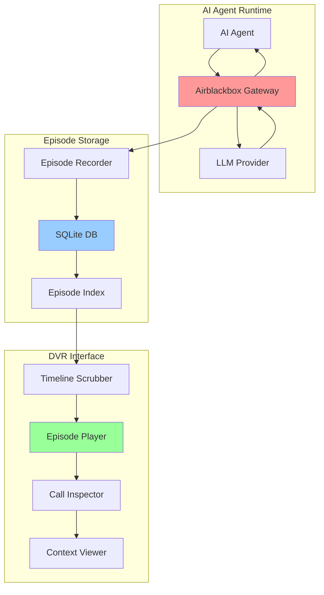

# Build a DVR for AI Agents: Episode Replay UI That Actually Works

**Your AI agent made 47 LLM calls, burned $12, and returned "I don't know" — and you have zero visibility into what went wrong at call #23.**

## The Problem: Debugging AI Agents Is Like Debugging Black Holes

Every AI agent conversation is a story told through a sequence of LLM calls. But when things go wrong — and they will — you're left staring at logs that look like this:

```
INFO: Agent started
INFO: LLM call completed
INFO: LLM call completed  
INFO: LLM call completed
ERROR: Task failed
```

Spectacular. Your agent made three calls and failed. Was it the prompt? The model temperature? A context window overflow? A hallucination at step 2 that poisoned everything downstream?

Traditional logging treats each LLM call as an isolated event. But AI agent conversations aren't isolated events — they're episodes with narrative flow, character development (your prompts), and plot twists (model responses). You need a DVR, not a logfile.

The current state of AI agent debugging:
- **CloudWatch/Datadog**: Great for servers, useless for conversation flow
- **Print statements**: Works until you hit production
- **LLM provider dashboards**: Shows you the calls, not the story
- **Memory**: Unreliable witness, especially at 3 AM

You need timeline scrubbing. You need to pause at call #23, see the exact prompt that went in, the response that came out, and the context that led to both. You need a DVR for AI episodes.

## Architecture: How Episode Replay Actually Works

Here's how we build a DVR that captures the full narrative arc of your AI agent conversations:



**Core Components:**

1. **Episode Recorder**: Captures every LLM call with full context, timestamps, and conversation threading
2. **Timeline Index**: Builds a scrubable timeline from raw call data
3. **Episode Player**: Renders the conversation flow with DVR controls
4. **Context Viewer**: Shows the full prompt engineering context at any point

The key insight: we're not just logging API calls. We're recording episodes with scene breaks, character development, and plot continuity.

## Implementation: Building the DVR

### Step 1: Set Up the Episode Recorder

First, install Airblackbox and set up the recording infrastructure:

```bash
pip install airblackbox[gateway] fastapi uvicorn
```

```python
# episode_recorder.py
import sqlite3
import json
import time
from datetime import datetime
from typing import Dict, List, Optional
from dataclasses import dataclass, asdict
from uuid import uuid4

@dataclass
class EpisodeCall:
    """A single LLM call within an episode"""
    call_id: str
    episode_id: str
    timestamp: float
    sequence: int
    model: str
    prompt_tokens: int
    completion_tokens: int
    request_body: Dict
    response_body: Dict
    latency_ms: float
    cost_estimate: float

class EpisodeRecorder:
    def __init__(self, db_path: str = "episodes.db"):
        self.db_path = db_path
        self._init_db()
    
    def _init_db(self):
        """Initialize the episode database"""
        conn = sqlite3.connect(self.db_path)
        conn.execute("""
            CREATE TABLE IF NOT EXISTS episodes (
                episode_id TEXT PRIMARY KEY,
                title TEXT,
                created_at REAL,
                updated_at REAL,
                status TEXT,
                total_calls INTEGER DEFAULT 0,
                total_cost REAL DEFAULT 0.0
            )
        """)
        
        conn.execute("""
            CREATE TABLE IF NOT EXISTS episode_calls (
                call_id TEXT PRIMARY KEY,
                episode_id TEXT,
                timestamp REAL,
                sequence INTEGER,
                model TEXT,
                prompt_tokens INTEGER,
                completion_tokens INTEGER,
                request_body TEXT,
                response_body TEXT,
                latency_ms REAL,
                cost_estimate REAL,
                FOREIGN KEY (episode_id) REFERENCES episodes (episode_id)
            )
        """)
        
        conn.execute("""
            CREATE INDEX IF NOT EXISTS idx_episode_calls_episode_id 
            ON episode_calls (episode_id)
        """)
        
        conn.execute("""
            CREATE INDEX IF NOT EXISTS idx_episode_calls_sequence 
            ON episode_calls (episode_id, sequence)
        """)
        
        conn.commit()
        conn.close()
    
    def start_episode(self, title: str = None) -> str:
        """Start a new episode and return the episode ID"""
        episode_id = str(uuid4())
        if title is None:
            title = f"Episode {datetime.now().strftime('%Y-%m-%d %H:%M:%S')}"
        
        conn = sqlite3.connect(self.db_path)
        conn.execute("""
            INSERT INTO episodes (episode_id, title, created_at, updated_at, status)
            VALUES (?, ?, ?, ?, ?)
        """, (episode_id, title, time.time(), time.time(), "recording"))
        conn.commit()
        conn.close()
        
        return episode_id
    
    def record_call(self, episode_id: str, call_data: EpisodeCall):
        """Record a single LLM call in the episode"""
        conn = sqlite3.connect(self.db_path)
        
        # Insert the call
        conn.execute("""
            INSERT INTO episode_calls 
            (call_id, episode_id, timestamp, sequence, model, prompt_tokens, 
             completion_tokens, request_body, response_body, latency_ms, cost_estimate)
            VALUES (?, ?, ?, ?, ?, ?, ?, ?, ?, ?, ?)
        """, (
            call_data.call_id,
            call_data.episode_id,
            call_data.timestamp,
            call_data.sequence,
            call_data.model,
            call_data.prompt_tokens,
            call_data.completion_tokens,
            json.dumps(call_data.request_body),
            json.dumps(call_data.response_body),
            call_data.latency_ms,
            call_data.cost_estimate
        ))
        
        # Update episode stats
        conn.execute("""
            UPDATE episodes 
            SET updated_at = ?, 
                total_calls = total_calls + 1,
                total_cost = total_cost + ?
            WHERE episode_id = ?
        """, (time.time(), call_data.cost_estimate, episode_id))
        
        conn.commit()
        conn.close()
```

### Step 2: Build the Timeline Scrubber

```python
# timeline_scrubber.py
from typing import List, Optional
import sqlite3
import json

class TimelineScrubber:
    def __init__(self, db_path: str = "episodes.db"):
        self.db_path = db_path
    
    def get_episode_timeline(self, episode_id: str) -> List[Dict]:
        """Get the full timeline for an episode"""
        conn = sqlite3.connect(self.db_path)
        conn.row_factory = sqlite3.Row
        
        cursor = conn.execute("""
            SELECT * FROM episode_calls 
            WHERE episode_id = ? 
            ORDER BY sequence ASC
        """, (episode_id,))
        
        timeline = []
        for row in cursor.fetchall():
            timeline.append({
                'call_id': row['call_id'],
                'sequence': row['sequence'],
                'timestamp': row['timestamp'],
                'model': row['model'],
                'prompt_tokens': row['prompt_tokens'],
                'completion_tokens': row['completion_tokens'],
                'request_body': json.loads(row['request_body']),
                'response_body': json.loads(row['response_body']),
                'latency_ms': row['latency_ms'],
                'cost_estimate': row['cost_estimate']
            })
        
        conn.close()
        return timeline
    
    def scrub_to_call(self, episode_id: str, call_sequence: int) -> Optional[Dict]:
        """Scrub to a specific call in the timeline"""
        conn = sqlite3.connect(self.db_path)
        conn.row_factory = sqlite3.Row
        
        cursor = conn.execute("""
            SELECT * FROM episode_calls 
            WHERE episode_id = ? AND sequence = ?
        """, (episode_id, call_sequence))
        
        row = cursor.fetchone()
        conn.close()
        
        if not row:
            return None
        
        return {
            'call_id': row['call_id'],
            'sequence': row['sequence'],
            'timestamp': row['timestamp'],
            'model': row['model'],
            'prompt': self._extract_prompt(json.loads(row['request_body'])),
            'response': self._extract_response(json.loads(row['response_body'])),
            'metadata': {
                'prompt_tokens': row['prompt_tokens'],
                'completion_tokens': row['completion_tokens'],
                'latency_ms': row['latency_ms'],
                'cost_estimate': row['cost_estimate']
            }
        }
    
    def _extract_prompt(self, request_body: Dict) -> str:
        """Extract the actual prompt from the request body"""
        if 'messages' in request_body:
            # Chat completion format
            messages = request_body['messages']
            if messages:
                return messages[-1].get('content', '')
        elif 'prompt' in request_body:
            # Text completion format
            return request_body['prompt']
        return "No prompt found"
    
    def _extract_response(self, response_body: Dict) -> str:
        """Extract the actual response from the response body"""
        if 'choices' in response_body and response_body['choices']:
            choice = response_body['choices'][0]
            if 'message' in choice:
                return choice['message'].get('content', '')
            elif 'text' in choice:
                return choice['text']
        return "No response found"
```

### Step 3: Create the DVR Interface

```python
# dvr_interface.py
from fastapi import FastAPI, Request
from fastapi.responses import HTMLResponse
from fastapi.templating import Jinja2Templates
import uvicorn

app = FastAPI(title="AI Agent DVR")
templates = Jinja2Templates(directory="templates")

@app.get("/episodes", response_class=HTMLResponse)
async def list_episodes(request: Request):
    """List all recorded episodes"""
    conn = sqlite3.connect("episodes.db")
    conn.row_factory = sqlite3.Row
    
    cursor = conn.execute("""
        SELECT * FROM episodes 
        ORDER BY created_at DESC
    """)
    
    episodes = [dict(row) for row in cursor.fetchall()]
    conn.close()
    
    return templates.TemplateResponse("episodes.html", {
        "request": request,
        "episodes": episodes
    })

@app.get("/episodes/{episode_id}", response_class=HTMLResponse)
async def view_episode(request: Request, episode_id: str):
    """View a specific episode with DVR controls"""
    scrubber = TimelineScrubber()
    timeline = scrubber.get_episode_timeline(episode_id)
    
    return templates.TemplateResponse("episode_player.html", {
        "request": request,
        "episode_id": episode_id,
        "timeline": timeline
    })

@app.get("/episodes/{episode_id}/call/{sequence}")
async def get_call_details(episode_id: str, sequence: int):
    """Get detailed view of a specific call"""
    scrubber = TimelineScrubber()
    call_data = scrubber.scrub_to_call(episode_id, sequence)
    
    if not call_data:
        return {"error": "Call not found"}
    
    return call_data

# Wire up to Airblackbox Gateway
from airblackbox import GatewayRecorder

recorder = EpisodeRecorder()

@app.middleware("http")
async def record_episode_middleware(request: Request, call_next):
    """Middleware to record LLM calls as episodes"""
    response = await call_next(request)
    
    # This is where you'd integrate with Airblackbox Gateway
    # to capture and record the actual LLM calls
    
    return response
```

### Step 4: Build the Frontend DVR Controls

Create `templates/episode_player.html`:

```html
<!DOCTYPE html>
<html>
<head>
    <title>Episode Player - AI Agent DVR</title>
    <style>
        .timeline-scrubber {
            width: 100%;
            margin: 20px 0;
        }
        
        .call-marker {
            display: inline-block;
            width: 20px;
            height: 20px;
            background: #007bff;
            margin: 2px;
            cursor: pointer;
            border-radius: 3px;
        }
        
        .call-marker.error {
            background: #dc3545;
        }
        
        .call-marker.active {
            background: #28a745;
            transform: scale(1.2);
        }
        
        .call-details {
            border: 1px solid #ddd;
            padding: 20px;
            margin: 20px 0;
            border-radius: 5px;
        }
        
        .prompt, .response {
            background: #f8f9fa;
            padding: 15px;
            margin: 10px 0;
            border-radius: 3px;
            white-space: pre-wrap;
        }
        
        .controls {
            margin: 20px 0;
        }
        
        button {
            padding: 10px 15px;
            margin: 5px;
            border: none;
            border-radius: 3px;
            cursor: pointer;
        }
        
        .play { background: #28a745; color: white; }
        .pause { background: #ffc107; }
        .stop { background: #dc3545; color: white; }
    </style>
</head>
<body>
    <h1>Episode Player: {{ episode_id }}</h1>
    
    <div class="controls">
        <button class="play" onclick="playEpisode()">▶ Play</button>
        <button class="pause" onclick="pauseEpisode()">⏸ Pause</button>
        <button class="stop" onclick="stopEpisode()">⏹ Stop</button>
        <span id="playback-status">Ready</span>
    </div>
    
    <div class="timeline-scrubber">
        <h3>Timeline ({{ timeline|length }} calls)</h3>
        
        <div class="call-marker" 
             data-sequence="{{ call.sequence }}"
             data-call-id="{{ call.call_id }}"
             onclick="scrubToCall({{ call.sequence }})">
        </div>
        
    </div>
    
    <div id="call-details" class="call-details" style="display: none;">
        <h3>Call <span id="call-sequence"></span></h3>
        <div class="metadata">
            <strong>Model:</strong> <span id="call-model"></span><br>
            <strong>Latency:</strong> <span id="call-latency"></span>ms<br>
            <strong>Cost:</strong> $<span id="call-cost"></span><br>
            <strong>Tokens:</strong> <span id="call-tokens"></span>
        </div>
        
        <h4>Prompt</h4>
        <div class="prompt" id="call-prompt"></div>
        
        <h4>Response</h4>
        <div class="response" id="call-response"></div>
    </div>

    <script>
        let currentCall = 0;
        let isPlaying = false;
        let playbackTimer = null;
        
        function scrubToCall(sequence) {
            currentCall = sequence;
            loadCallDetails(sequence);
            updateMarkers();
        }
        
        function loadCallDetails(sequence) {
            fetch(`/episodes/{{ episode_id }}/call/${sequence}`)
                .then(response => response.json())
                .then(data => {
                    document.getElementById('call-sequence').textContent = data.sequence;
                    document.getElementById('call-model').textContent = data.model;
                    document.getElementById('call-latency').textContent = data.metadata.latency_ms;
                    document.getElementById('call-cost').textContent = data.metadata.cost_estimate;
                    document.getElementById('call-tokens').textContent = 
                        `${data.metadata.prompt_tokens} → ${data.metadata.completion_tokens}`;
                    document.getElementById('call-prompt').textContent = data.prompt;
                    document.getElementById('call-response').textContent = data.response;
                    document.getElementById('call-details').style.display = 'block';
                });
        }
        
        function updateMarkers() {
            document.querySelectorAll('.call-marker').forEach(marker => {
                marker.classList.remove('active');
                if (parseInt(marker.dataset.sequence) === currentCall) {
                    marker.classList.add('active');
                }
            });
        }
        
        function playEpisode() {
            isPlaying = true;
            document.getElementById('playback-status').textContent = 'Playing';
            
            playbackTimer = setInterval(() => {
                if (currentCall < {{ timeline|length }}) {
                    scrubToCall(currentCall);
                    currentCall++;
                } else {
                    pauseEpisode();
                }
            }, 2000);
        }
        
        function pauseEpisode() {
            isPlaying = false;
            document.getElementById('playback-status').textContent = 'Paused';
            if (playbackTimer) {
                clearInterval(playbackTimer);
            }
        }
        
        function stopEpisode() {
            pauseEpisode();
            currentCall = 0;
            document.getElementById('playback-status').textContent = 'Stopped';
            updateMarkers();
        }
    </script>
</body>
</html>
```

## Pitfalls: What Will Break and How to Handle It

### 1. Memory Overflow on Large Episodes
**Problem**: Episodes with 1000+ LLM calls will kill your browser and your database.

**Solution**: Implement pagination and lazy loading:

```python
def get_episode_timeline(self, episode_id: str, 
                        offset: int = 0, limit: int = 100) -> Dict:
    conn = sqlite3.connect(self.db_path)
    
    # Get total count
    total_calls = conn.execute("""
        SELECT COUNT(*) FROM episode_calls WHERE episode_id = ?
    """, (episode_id,)).fetchone()[0]
    
    # Get paginated results
    cursor = conn.execute("""
        SELECT * FROM episode_calls 
        WHERE episode_id = ? 
        ORDER BY sequence ASC
        LIMIT ? OFFSET ?
    """, (episode_id, limit, offset))
    
    return {
        'timeline': [dict(row) for row in cursor.fetchall()],
        'total_calls': total_calls,
        'has_more': offset + limit < total_calls
    }
```

### 2. Context Window Reconstruction Hell
**Problem**: Your agent's context window evolves throughout the episode, but you're only storing individual requests.

**Solution**: Store conversation state at each checkpoint:

```python
@dataclass
class EpisodeCall:
    # ... existing fields ...
    context_window: List[Dict]  # Full conversation history at this point
    system_prompt: str          # System prompt for this call
    conversation_id: str        # Link to conversation thread
```

### 3. Cost Explosion from Storing Everything
**Problem**: Storing full request/response bodies gets expensive fast.

**Solution**: Implement selective recording with compression:

```python
class EpisodeRecorder:
    def __init__(self, 
                 compress_requests: bool = True,
                 max_prompt_length: int = 10000,
                 store_embeddings: bool = False):
        self.compress_requests = compress_requests
        self.max_prompt_length = max_prompt_length
        self.store_embeddings = store_embeddings
    
    def _compress_request(self, request_body: Dict) -> Dict:
        if self.compress_requests:
            # Truncate very long prompts
            if 'messages' in request_body:
                for msg in request_body['messages']:
                    if len(msg.get('content', '')) > self.max_prompt_length:
                        msg['content'] = msg['content'][:self.max_prompt_length] + "... [truncated]"
        
        return request_body
```

## Measurement: How to Know It's Working

Your DVR is working when debugging changes from this:

```bash
# Before
tail -f agent.log | grep ERROR
# Stares at logs for 20 minutes
# Gives up and hopes for the best
```

To this:

```bash
# After
# Opens DVR interface
# Scrubs to call #23 where things went wrong
# Sees exact prompt and response
# Identifies the issue in 30 seconds
# Fixes the problem
```

**Key metrics to track:**
- **Mean Time to Debug (MTTD)**: How long from "something's wrong" to "found the issue"
- **Debug success rate**: Percentage of issues resolved without "try random changes"
- **Context reconstruction accuracy**: Can you rebuild the agent's state at any point?

**Health checks for your DVR:**
```python
def health_check():
    recorder = EpisodeRecorder()
    
    # Can we record a test episode?
    episode_id = recorder.start_episode("Health Check")
    
    # Can we retrieve it?
    scrubber = TimelineScrubber()
    timeline = scrubber.get_episode_timeline(episode_id)
    
    # Can we scrub to specific calls?
    assert scrubber.scrub_to_call(episode_id, 0) is not None
    
    print("✅ DVR is healthy")
```

## Next Steps: From DVR to AI Agent Debugging Mastery

You now have a working DVR for AI agent conversations. But this is just the foundation. The real power comes when you integrate this with your actual agent workflows.

**Try the complete implementation:**
- 🔧 [Clone the demo repo](https://github.com/airblackbox/agent-dvr-tutorial) with working code
- 📚 [Read the Airblackbox docs](https://docs.airblackbox.ai) for production integration  
- 🚀 [Set up the Gateway](https://docs.airblackbox.ai/gateway) to start recording your agents automatically

The difference between debugging AI agents with logs vs. with a DVR is the difference between reading a screenplay and watching the actual movie. Your agents are telling stories —